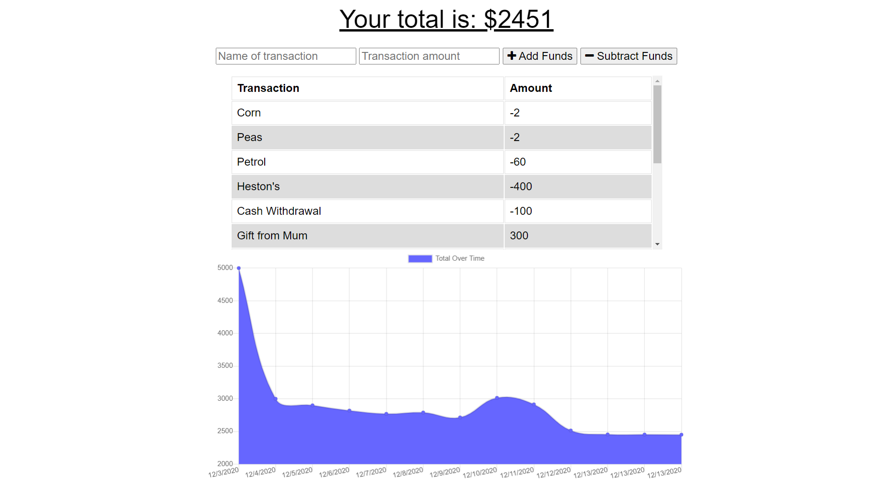

# Budget Tracker

  

## Description

A budget tracking application designed for travellers or for users that need to track their budget in areas with a low mobile signal or low data access. Budget Tracker is a Progressive Web App that can be installed onto mobile devices for a richer user experience. Using the clients IndexedDB and cache memory budget tracker can log expenses and incomes without access to the MongoDB database and when the data connection is re-established all the saved logs will be automatically pushed to the clients database.

## Technologies

- HTML
- CSS
- JavaScript
- Bootstrap
- Node.js
- Express.js
- MongoDB
- Mongoose
- Service Workers
- PWA

## Installation

After cloning the project to your device open a terminal in the project folder and type `npm install` then `npm start` and open in your browser http://localhost:3000

## Deployed Link

https://budget-tracker5000.herokuapp.com/

## Screenshot

## Contact

Got any questions? Please contact me at tmhaigh@gmail.com 
View my online portfolio https://conanas.github.io/ 
View my LinkedIn https://www.linkedin.com/in/thomas-m-haigh/

